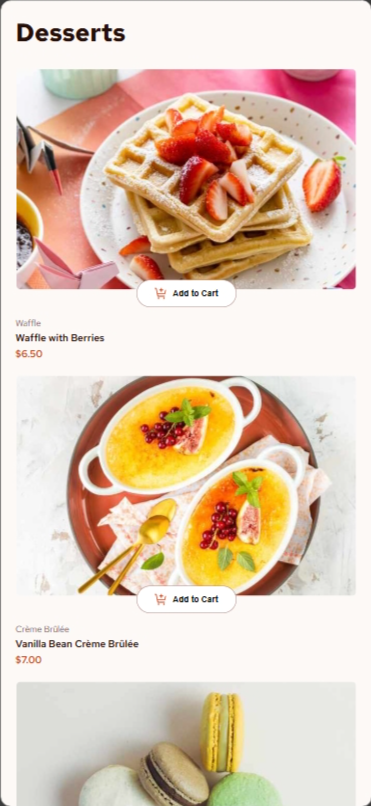
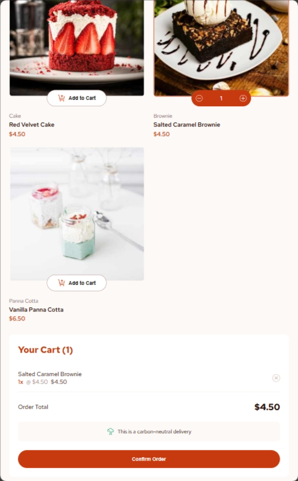
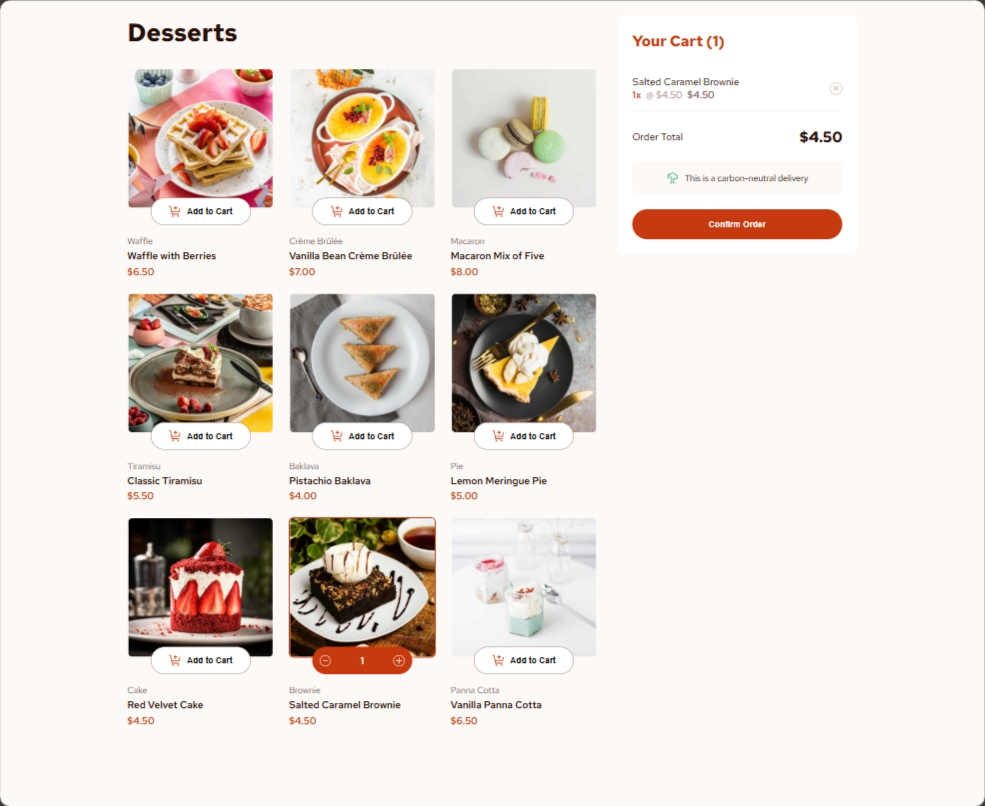

# Product List with Cart

A responsive, functional dessert menu application built with **React** and **Vite**. This project features a dynamic shopping cart, order confirmation modal, and persistent data storage using browser LocalStorage.


## 🚀 Features

* **Responsive Design**: Optimized for Mobile, Tablet, and Desktop using CSS Grid and Flexbox.
* **Dynamic Cart**: Add items, remove items, and update quantities in real-time.
* **Persistent State**: Your cart items remain saved even after refreshing the page (via `localStorage`).
* **Order Confirmation**: A detailed summary modal appears upon order completion.
* **Hover & Active States**: Custom interactive elements for a premium user experience, matching professional designs.

## 🛠️ Built With

* **React** (Functional Components & Hooks)
* **CSS3** (Custom Properties & Media Queries)
* **Vite** (Build Tool)
* **JSON** (Local data sourcing)

## 📦 Getting Started

1.  **Clone the repository**:
    ```bash
    git clone [https://github.com/edyreuben/product-list-with-chart-final-assessment-week-12.git]
    ```

2.  **Install dependencies**:
    ```bash
    npm install
    ```

3.  **Run the development server**:
    ```bash
    npm run dev
    ```

4.  **Build for production**:
    ```bash
    npm run build
    ```

## 📸 Screen Designs

The application adapts to three primary screen sizes. Below are the previews for Mobile, Tablet, and Desktop views:

| Mobile View | Tablet View | Desktop View |
| :---: | :---: | :---: |
|  |  |  |
| *Single column layout* | *Two-column product grid* | *Three-column grid with sidebar* |


## 📝 Persistence Logic

The app uses a custom `useEffect` hook to synchronize the application state with the browser's `localStorage`. This ensures that users do not lose their selections if they accidentally navigate away or refresh the browser.
```jsx
    // Initialize state from LocalStorage
    const [cart, setCart] = useState(() => {
        const savedCart = localStorage.getItem('product_cart');
        return savedCart ? JSON.parse(savedCart) : [];
    });
```

## 💡 What I Learned

During this project, I strengthened my understanding of the React lifecycle and responsive design patterns:

* **State Persistence**: I learned how to use `useEffect` to synchronize the app state with `localStorage`, ensuring the user's shopping cart isn't lost on page refresh.

    ```jsx
    // Initializing state from storage
    const [cart, setCart] = useState(() => {
        const savedCart = localStorage.getItem('dessert_cart');
        return savedCart ? JSON.parse(savedCart) : [];
    });

    // Syncing changes to storage
    useEffect(() => {
        localStorage.setItem('dessert_cart', JSON.stringify(cart));
    }, [cart]);
    ``` 

* **Complex Grid Layouts**: Implementing a layout that shifts from a single column (mobile) to a multi-column grid with a fixed sidebar (desktop).
    ```css
   /* Sidebar logic for Desktop */
    .content-wrapper {
        display: grid;
        grid-template-columns: 1fr;
        gap: 32px;
    }

    @media (min-width: 1024px) {
        .content-wrapper {
            grid-template-columns: 1fr 384px; /* Product grid and Sidebar Cart */
            align-items: start;
        }
    }
    ```

* **SVG Manipulation**: Using inline SVGs to allow dynamic CSS styling (changing icon colors on hover/active states).
    ```css
    /* Styling SVG paths on parent hover */
    .qty-btn:hover {
        background: white;
    }

    .qty-btn:hover svg path {
        fill: var(--red); /* Dynamic color change */
    }
    ```

* **Conditional Rendering**: Managing the display of the "Empty Cart" state versus the "Active Cart" state and the "Order Confirmation" modal.
    ```jsx
    const updateQuantity = (name, delta) => {
        setCart(prevCart => 
            prevCart.map(item => 
                item.name === name 
                    ? { ...item, quantity: item.quantity + delta } 
                    : item
            ).filter(item => item.quantity > 0)
        );
    };
    ```

## 🤖 AI Collaboration

This project was developed with the assistance of **AI (Gemini)**. Through this collaboration, I was able to:
* Efficiently debug responsive layout issues.
* Implement best practices for persistent data storage.
* Quickly iterate on CSS transitions and active states to match the provided design mockups.
* Refine the logic for managing quantities within an array of objects in React state.

## 🙏 Acknowledgments

I would like to express my sincere gratitude to the following for making this learning journey possible:

* **Techyjaunt**: Thank you for the scholarship and the incredible opportunity to learn and grow in the tech space.
* **Oga Stanley**: A big thank you to my tutor for the guidance, mentorship, and support throughout this project.